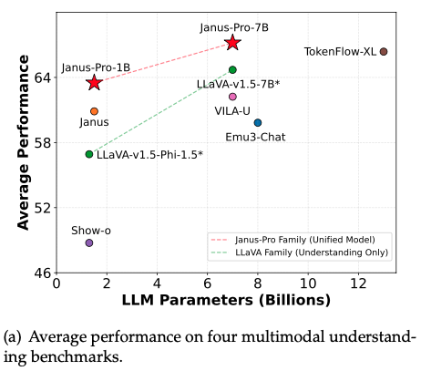

# MARP Tutorial: Creating Presentations with Markdown  

*Target Audience: Users with computing/physics backgrounds*  

---

## **1. Introduction to MARP**  
**What is MARP?**  
MARP (Markdown Presentation Ecosystem) converts Markdown files into slideshows (HTML, PDF, PPTX). It combines the simplicity of Markdown with features like:  
- **Math support** (KaTeX for equations).  
- **Code highlighting** (great for coding examples).  
- **Customizable themes** (CSS/SCSS).  
- **Live preview** (via VSCode, CLI, etc.).  

---

**Why Use MARP?**  
- Avoid GUI tools like PowerPoint.  
- Replace verbose LaTeX Beamer with lightweight Markdown.  
- Version-control presentations with Git.  
- Perfect for **technical content** (equations, code, diagrams).  
- **No compilation** (no need to compile LaTeX).  
- **Easy installation** (via VSCode).  
- **Pure Markdown** (no need to learn new syntax).  

---

## **2. Installation**  
### **Option 1: VS Code Extension (Recommended)**  
1. Install [VS Code](https://code.visualstudio.com/).  
2. Install the **Marp for VS Code** extension.  

### **Option 2: CLI via npm**  
```bash
npm -g install @marp-team/marp-cli
```

---

## **3. Basic Usage**  

### **Setting up the environment**      
Put the following in the top of the file:  
```markdown
---
marp: true
---
```

--- 

### **Creating Slides**  
Separate slides with `---`:  
```markdown
# Slide 1
Hello, World!

---

## Slide 2
- Item 1  
- Item 2  
```  
---

### **Code Blocks**  
Use triple backticks with language syntax:  
````markdown
```python
def fibonacci(n):
    return n if n <= 1 else fibonacci(n-1) + fibonacci(n-2)
```
````  
---

### **Math Equations**  
Enable KaTeX with `math: katex` in the front-matter:  
```markdown

### Schrödinger Equation  
$$
i\hbar \frac{\partial}{\partial t} \Psi = \hat{H} \Psi
$$
```
$$
i\hbar \frac{\partial}{\partial t} \Psi = -\frac{\hbar^2}{2m} \nabla^2 \Psi + \hat{V} \Psi
$$

$$\mathcal{H} = \mathcal{T} + \mathcal{V}\quad \mathbb{R}$$

---

### **Images**  

<div class="columns">   
<div class="rounded-frame">



</div>
<div>

</div>
</div>

<!-- _footer: 'Wu, Chengyue, et al. "Janus: Decoupling visual encoding for unified multimodal understanding and generation." arXiv preprint arXiv:2410.13848 (2024).' -->

---

## **Tables**

|ID|Full Name|Score|
|---|:---|:-:|
|127|João da Silva Moreira|100|
|342|Maria Oliveira|90|
<div class="caption">Table 1: Students scores.</div>

---


Here is a message with beautiful background!

Be happy!

---

## **4. Advanced Topics**  
### **Multi-Column Layouts**  
Use HTML comments to split content:  
```markdown
<div class="columns">
<div>

**Left Column**  

</div>
<div>

**Right Column**  

</div>
</div>
```

---

<div class="columns">
<div>

**Left Column**  
|ID|Full Name|Score|
|---|:---|:-:|
|127|João da Silva Moreira|100|
|342|Maria Oliveira|90|

</div>
<div class="rounded-frame">


</div>
</div>

---

## **5. Exporting Slides**  
### **Via VS Code**  
1. Open the command palette (`Ctrl+Shift+P`).  
2. Select **MARP: Export slide deck**.  

### **Via CLI**  
```bash
marp --input-dir ./slides --pdf
```  

---

## **6. Best Practices**  
- **Keep slides concise**: Use bullet points, not paragraphs.  
- **Leverage visuals**: Embed plots/diagrams (e.g., Matplotlib exports).  
- **Test rendering**: Preview themes and math syntax early.  

---

## **7. Conclusion**  
MARP streamlines creating technical presentations by combining Markdown’s simplicity with powerful features like code blocks, KaTeX, and themes. Its CLI/VS Code integration fits perfectly into a developer/scientist workflow.  

**Next Steps**:  
- Explore [official docs](https://marp.app/).  
- Experiment with custom SCSS themes.  
- Integrate MARP into your CI/CD pipeline for automated PDF generation.  
